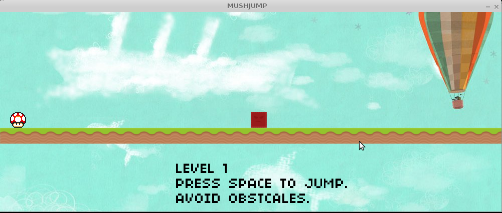

# MUSHJUMP

Mushroom jump. a simple game made with lua and love2d.

# How to run the game

1. download and install love2d from [https://love2d.org](https://love2d.org) (make sure to download version 11.1).
2. download this repo as a zip file.
3. rename `mushjump.zip` to `mushjump.love`.
4. run the `.love` file with love2d.
